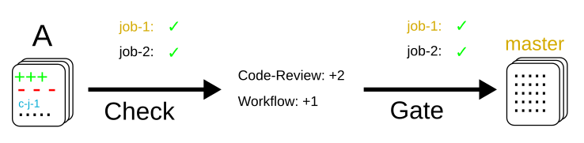
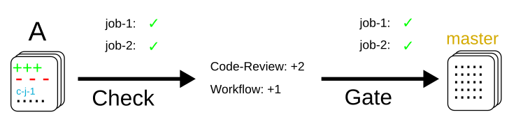

Zuul Hands on - Job Secrets
---------------------------

In this article, we will explain how to use job secrets stored directly
in the git repositories of projects.

Please run :ref:`quick-start` first to get a Zuul system up and running if
you don't already have one.

Projects Types: config vs untrusted
...................................

Zuul defines two categories of projects:

* **config** projects, and
* **untrusted** projects.

The main difference is that config projects are **protected** and changes to
their Zuul configuration **are not tested speculatively**.
Untrusted projects' configuration changes are tested speculatively before
being merged, while config project configuration are only effective after
being merged.

Let's vizualize the difference on some workflow diagrams:

Untrusted projects
******************

Let's assume *A* is an incoming patch to an **untrusted** project. *A*
modifies the *job-1* being run in the **check** gate (*job-1*,
the modified job is pictured in orange below). Merging this change will look
like this in terms of workflow:

The change gets tested speculatively, therefore the change to *job-1*
is used immediately in the **check** and **gate** pipeline, **before** being
merged.

Config projects
***************

Let's assume now that *A* is an incoming patch on a **config** project.
Merging this change will look like this in terms of workflow:

This time, the change to *job-1* is not applied in the **check** or **gate**
pipeline. The rationale here is that changes to a config project are impactful
and need to be reviewed by humans before being run automatically. If they
were run as soon as the check pipeline, nothing would prevent a malicious user
from leaking passwords used in the jobs, for example.

Once A is merged, subsequent patches get tested with the new changes:

.. image:: images/config-project-workflow-B.png

Regarding secrets, the main difference between **untrusted** and **config**
projects is that for security reasons, untrusted projects' secrets shall only
be used in post-review_ pipelines such as the pre-defined
**"periodic"** or **"post"**.

Using a secret in a config project
..................................

A typical use case is a secret needed by a publishing or deployment job.

To encrypt a custom secret, you can use the `encrypt_secret.py`_ script
from the Zuul source repository. This script needs
the tenant name and project name to retrieve the project's public key and
properly encrypt the secret. We will use it to encrypt a custom secret
for the config project.

.. code-block:: bash

   # form zuul directory
   ./tools/encrypt_secret.py --tenant example-tenant http://localhost:9000/ zuul-config
   # Type a secret, press enter and hit Ctrl-D. The script outputs:
   writing RSA key
   Public key length: 4096 bits (512 bytes)
   Max plaintext length per chunk: 470 bytes
   Input plaintext length: 5 bytes
   Number of chunks: 1

   - secret:
       name: <name>
       data:
         <fieldname>: !encrypted/pkcs1-oaep
           - joTrPXkIVs9mp9Kh88ly1HAE64Ygu5yRxlrPslb8vG7qNA2isRdvhwO5I5+4WhfjNK43q
             HjCdeIc9LmqZHi5cglYiHHjHZYNhDXatOUt+T7fotyb+VMkXrZj8EiHINgggbJH+/lHBU
             YFhyqjBojyTq1TQUl7FiexTfZS2KFU1st5GgPNcxJJQ2g4lcyXuWNFauC5C4PU08mn1mi

   # You can also check and get the public key manually:
   curl -k http://localhost:9000/api/tenant/example-tenant/key/config.pub

Use the --infile option if the secret is a certificate file or a SSH key.
Write the output to a new zuul configuration file in the config
project like that:

Clone **zuul-config**:

.. code-block:: bash

  git clone http://localhost:8080/zuul-config
  cd zuul-config
  git review -s

Create file **zuul.d/my-secret.yaml** and replace the password payload with
the output of `encrypt_secret.py`

.. code-block:: yaml

  ---
  - secret:
      name: my-publication-secret
      data:
        # Extra cleartext data can be added to a secret
        hostname: publication-host.example.com
        password: !encrypted/pkcs1-oaep
          - joTrPXkIVs9mp9Kh88ly1HAE64Ygu5yRxlrPslb8vG7qNA2isRdvhwO5I5+4WhfjNK43q
            HjCdeIc9LmqZHi5cglYiHHjHZYNhDXatOUt+T7fotyb+VMkXrZj8EiHINgggbJH+/lHBU
            ...

The secret can be attached to a job like so:

Create file **zuul.d/my-job.yaml**

.. literalinclude:: ../examples/test1-job-secrets/config-project/zuul.d/my-job.yaml
   :language: yaml

Finally, when the playbook is executed, the secret content will be decrypted
and available as the secret name dictionary:

Create file **playbooks/my-publication.yaml**

.. literalinclude:: ../examples/test1-job-secrets/config-project/playbooks/my-publication.yaml
   :language: yaml

Commit the 3 files and merge them in the config project:

.. code-block:: bash

   git add -A
   git commit -m "Provide my publication job"
   git review

Approve the change on Gerrit and wait for the change to be merged

Then we can test that the new job by adding it to the test1's pipeline.

We can now clone **test1**:

.. code-block:: bash

  git clone http://localhost:8080/test1
  cd test1
  git review -s

You will be prompted for your username on Gerrit, use your account username.

If you went through others articles of the series and **test1** already exists,
reset the state to origin/master and remove existing files

.. code-block:: bash

  cd test1
  git fetch --all --prune
  git reset --hard origin/master
  rm -rf .zuul.yaml *

.. literalinclude:: ../examples/test1-job-secrets/config-project-test1/zuul.yaml
   :language: yaml

Commit this file in the test1 project and use git-review to trigger the
job execution:

.. code-block:: bash

   git add .zuul.yaml
   git commit -m "Configure project pipelines"
   git review

.. image:: /images/job-secrets-1.png
   :align: center

As you can see, the job can be used by any project and the playbook is
executed with the secret decrypted. The **env** command is leaking
the secret content, thus when writing job that uses secret,
it is recommended to make sure the secret is not exposed
during the job execution.

Because the job is defined in a config project, a malicious user can
not submit a review with a new playbook task to dump the secret
content because the job's content is not evaluated speculatively.
Read below for more `Security Considerations`_.

Using an untrusted-project secret
.................................

Secrets don't have to be set exclusively in config projects. In this example
we are going to create a publish-to-pypi job for the test1
project so that it is published to pypi on release. To do that we will
use the **build-python-release** and **upload-pypi** roles from zuul-jobs_.

.. TODO: figure out how to setup python project template
.. TODO: Add paragraph about account creation on https://test.pypi.org/
.. TODO: Add info about release pipeline creation

Reinit **test1** to Initial Commit on your local clone and on gerrit

.. code-block:: bash

  git reset --hard $(git log --pretty=oneline | grep "Initial commit" | awk {'print $1'} | head -1)
  git push gerritadmin

The default release process uses wheel packaging, thus you will have
to update the setup.py to use setuptools:

Create file **setup.py**

.. literalinclude:: ../examples/test1-job-secrets/untrusted-project/setup.py
   :language: python

Create a test account on https://test.pypi.org/
Encrypt your pypi test account password using this command:

.. code-block:: bash

   ./tools/encrypt_secret.py --tenant example-tenant http://localhost:9000 test1

Create this test1 **.zuul.yaml** configuration and replace the password payload with
the output of `encrypt_secret.py` :

.. code-block:: yaml

  ---
  - secret:
      name: my-pypi-secret
      data:
        username: my-pypi-account
        password: !encrypted/pkcs1-oaep
          - vY1AfQZimyeFgKchVZYoF9hTcF511U6wS7PZFrzX/+po15a45Nt4mia/RNz/3+dRhi8ip
            6xIBD8S7JzrwmfovGg1fDPtNwSFO+awZ5f/B6aH35X0nuC5OQ3Jeu641inhNonuSKJ6Sh
            ...

  - job:
      name: my-upload-pypi
      description: Release wheel to pypi using my-pypi-account
      run: playbooks/publish/release.yaml
      post-run: playbooks/publish/pypi.yaml
      secrets:
        - name: pypi_info
          secret: my-pypi-secret

  - project:
      check:
        jobs:
          - tox-pep8
      gate:
        jobs:
          - tox-pep8
      release:
        jobs:
          - my-upload-pypi

Create the tox configuration **tox.ini**:

.. literalinclude:: ../examples/test1-job-secrets/config-project-test1/tox.ini
   :language: ini

Create the run playbook **playbooks/publish/release.yaml**:

.. literalinclude:: ../examples/test1-job-secrets/untrusted-project/playbooks/publish/release.yaml
   :language: yaml

And the post playbook **playbooks/publish/pypi.yaml**:

.. literalinclude:: ../examples/test1-job-secrets/untrusted-project/playbooks/publish/pypi.yaml
   :language: yaml

Commit the 4 files and merge them in the test1 project:

.. code-block:: bash

   git add -A
   git commit -m "Provide my upload-pypi job"
   git review

and approve the change on Gerrit and wait for the change to be merged

Add a release pipeline in zuul-config,
edit **zuul-config/zuul.d/pipelines.yaml**:

.. code-block:: yaml

  - pipeline:
    name: check
    description: |
      Newly uploaded patchesets enter this pipeline to receive an
      initial +/-1 Verified vote.
    manager: independent
    require:
      gerrit:
      open: True
      current-patcheset: True
    trigger:
      gerrit:
      - event: patcheset-created
      - event: change-restored
      - event: comment-added
        comment: (?i)^(Patch Set [0-9]+:)?( [\w\\+-]*)*(\n\n)?\s*recheck
    success:
      gerrit:
      Verified: 1
      mysql:
    failure:
      gerrit:
      Verified: -1
      mysql:

  - pipeline:
    name: gate
    description: |
      Changes that have been approved are enqueued in order in this
      pipeline, and if they pass tests, will be merged.
    manager: dependent
    post-review: True
    require:
      gerrit:
      open: True
      current-patcheset: True
      approval:
        - Workflow: 1
    trigger:
      gerrit:
      - event: comment-added
        approval:
        - Workflow: 1
    start:
      gerrit:
      Verified: 0
    success:
      gerrit:
      Verified: 2
      submit: true
      mysql:
    failure:
      gerrit:
      Verified: -2
      mysql:

  - pipeline:
    name: release
    description: When a commit is tagged as a release, this pipeline runs jobs that publish archives and documentation.
    manager: independent
    precedence: high
    post-review: True
    trigger:
      gerrit:
      - event: ref-updated
        ref: ^refs/tags/[0-9]+(\.[0-9]+)*$
    success:
      mysql:
    failure:
      mysql:

Commit and upload

.. code-block:: bash

  # you should be in zuul-config repository
  git add -A
  git commit -m "Add release pipeline"
  git review

Approve the change on Gerrit and wait for the change to be merged.
Check that release pipeline is up on zuul

To test the publication job, push a new tag:

.. code-block:: bash

   cd test1
   # if you are rerunning this tutorial, choose a new tag
   git tag -f -a -m 0.0.1 0.0.1
   git push gerrit 0.0.1

Resulting in:

.. image:: /images/job-secrets-2.png
   :align: center

Go to https://test.pypi.org/manage/projects/

.. image:: /images/job-secrets-3.png
   :align: center

To restart the job, you can use the `zuul reenqueue` command:

.. code-block:: bash

   zuul enqueue-ref --tenant example-tenant --trigger gerrit \
        --pipeline release --project test1 \
        --ref refs/tags/0.0.1 \
        --newrev git-commit-sha1

To update the tag content, it's recommended to push a new tag
as Zuul doesn't handle reference deletion gracefully.

The job can be used by any project, but only in a
**post-review** pipeline (e.g. **post** or **release**). Attempting
to modify the release playbook and adding the job to
a check pipeline will result in a Zuul configuration
error to prevent malicious access to the secret.

.. _`Security Considerations`:

Security considerations
.......................

Here are some security considerations when using secrets
in Zuul jobs:

- Secrets may only be used by jobs defined within the same project.
- Config project secrets can be used in check pipelines, but
  be careful to prevent unexpected usage. For example, secrets
  shouldn't be written to disk in a pre run as a job's user may be
  able to access them during the speculative run phase.
- Be wary when holding a node that have used a secret because the secret may be
  recovered from the swap or the filesystem journal.
- Publication jobs can use the **post-review** job attribute
  to prevent usage in the check pipeline. Note that **post-review** is
  automatically set for untrusted projects' jobs using secrets.
- Jobs that have access to protected resources can be restricted
  to specific projects using the **allowed-projects** job attribute.

.. _`encrypt_secret.py`: https://opendev.org/zuul/zuul/tools/encrypt_secret.py
.. _post-review: https://zuul-ci.org/docs/zuul/user/config.html#attr-pipeline.post-review
.. _zuul-jobs: https://zuul-ci.org/docs/zuul-jobs/
